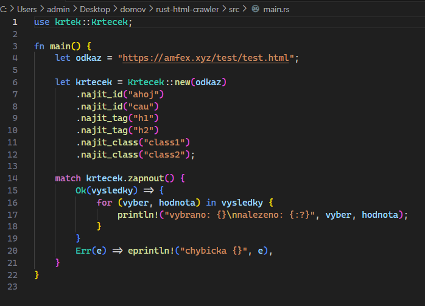
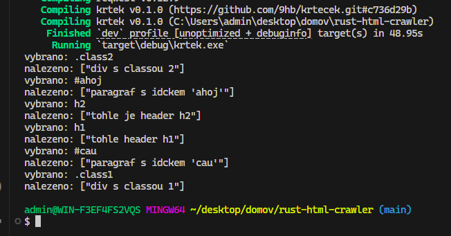

# Krteček

Knihovna pro hledání HTML elementů pomocí ID, tagů a class v HTML stránkách.

## Použití

```rust
use krtek::Krtecek;

let krtecek = Krtecek::new("https://example.com")
    .najit_id("username")
    .najit_tag("h1")
    .najit_class("container");
```

## Příklad



